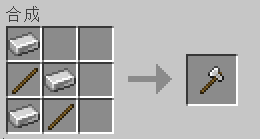
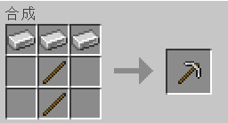
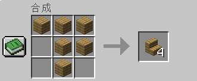

# Random Recipes

基于世界种子的工作台配方全局随机化 Fabric Mod。

进入世界时，用世界种子码**确定性**打乱所有工作台（crafting table）配方。同一存档配方永远相同，不同存档则完全不同。

## 功能

| 特性 | 说明 |
|------|------|
| **打乱物品顺序** | Fisher-Yates 洗牌，只对非空原料洗牌，不破坏空槽位结构 |
| **增减/替换原料** | 每配方 1~2 次变更：替换原料、随机增减（仅无序配方） |
| **全局物品池** | 单材料配方从全局物品池补充候选物，避免替代自身没效果 |
| **重复修正** | 随机化后自动检测重复配方并二次随机化破坏相同性 |
| **种子确定性** | `new Random(worldSeed)`，同存档永远获得同一套随机方案 |
| **保护机制** | 木镐/石镐/铁镐默认不参与随机化，避免存档不可玩 |
| **配置文件** | `config/random-recipes.json`，可手动增加更多保护项 |
| **reload 支持** | 修改配置文件后执行 `/reload` 即可生效 |
| **兼容其他 Mod** | 自动纳入所有 Mod 注册的工作台配方（`RecipeType.CRAFTING`） |

## 安装

1. 安装 [Fabric Loader](https://fabricmc.net/use/)
2. 下载 [Fabric API](https://modrinth.com/mod/fabric-api) 放入 `.minecraft/mods/`
3. 下载本 Mod 放入 `.minecraft/mods/`
4. 启动游戏，进入世界

## 配置文件

首次启动后自动生成 `config/random-recipes.json`：

```jsonc
{
  // 按物品 ID 保护——产出这些物品的所有配方都不会被随机化
  "protected_output_items": [
    "minecraft:wooden_pickaxe",
    "minecraft:stone_pickaxe",
    "minecraft:iron_pickaxe"
  ],
  // 按配方 ID 保护——精确到单个配方
  "protected_recipe_ids": []
}
```

### 示例：保护钻石装备 + 保护某个 Mod 配方

```json
{
  "protected_output_items": [
    "minecraft:wooden_pickaxe",
    "minecraft:stone_pickaxe",
    "minecraft:iron_pickaxe",
    "minecraft:diamond_pickaxe",
    "minecraft:diamond_sword"
  ],
  "protected_recipe_ids": [
    "mymod:special_sword"
  ]
}
```

改完后执行 `/reload` 即可。

## 截图

游戏内效果展示（配方的原料被打乱、替换）：





## 构建

```bash
# Windows
gradlew.bat build

# Linux / macOS
./gradlew build
```

构建产物在 `build/libs/random-recipes-*.jar`

## 依赖

- Fabric Loader ≥0.15
- Fabric API（任意版本）
- Minecraft 1.20.1

## 变更日志

### v1.0.2

- **修复**：单材料配方（如剪刀、压力板等仅用一种原料的）在 v1.0.1 中不会改变材料的问题。现在从全局物品池（所有配方出现的物品）中补充候选项，确保配方素材真正发生变化
- **修复**：重复配方修正——随机化后自动检测同产物同原料的重复配方，并对重复项做二次随机化破坏相同性
- **改进**：Fisher-Yates 洗牌只对非空原料槽位生效，避免打乱空槽位结构

### v1.0.1

- **修复**：启动崩溃——`RecipeManagerAccessor` accessor mixin 被错放在 `accessors` 列表下而不是 `mixins` 列表

### v1.0.0

- 首个发布版本

## 许可证

[MIT](LICENSE)